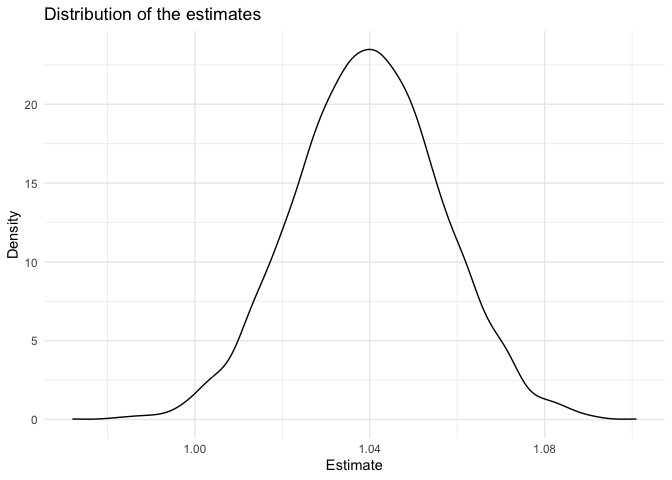

P8105_HW6_sy3269
================
Soomin You

Necessary packages such as `tidyverse` and `readr` for this homework was
loaded.

## Problem 1

The weather data required for problem 1 was imported as specified in the
P8105 website.

``` r
weather_df = 
  rnoaa::meteo_pull_monitors(
    c("USW00094728"),
    var = c("PRCP", "TMIN", "TMAX"), 
    date_min = "2017-01-01",
    date_max = "2017-12-31") %>%
  mutate(
    name = recode(id, USW00094728 = "CentralPark_NY"),
    tmin = tmin / 10,
    tmax = tmax / 10) %>%
  select(name, id, everything())
```

    ## using cached file: /Users/soomin.you/Library/Caches/org.R-project.R/R/rnoaa/noaa_ghcnd/USW00094728.dly

    ## date created (size, mb): 2024-09-03 14:09:15.067935 (8.636)

    ## file min/max dates: 1869-01-01 / 2024-09-30

Using the `tmax` as the response and `tmin` as the predictor,
bootstrapping was performed and estimates for 𝑟̂2 and log(𝛽̂0∗𝛽̂1) for each
bootstrap sample were determined.

``` r
boot_straps = 
  weather_df |>
  modelr::bootstrap(5000) |>
  mutate(
    strap = map(strap, as_tibble), 
    models = map(strap, \(df) lm(tmax ~ tmin, data = df)), 
    results_tidy = map(models, broom::tidy),
    results_glance = map(models, broom::glance)
  ) |>
  select(.id, results_tidy, results_glance) |>
  unnest(results_tidy, results_glance)
```

    ## Warning: `unnest()` has a new interface. See `?unnest` for details.
    ## ℹ Try `df %>% unnest(c(results_tidy, results_glance))`, with `mutate()` if
    ##   needed.

``` r
boot_straps |>
  group_by(.id, r.squared) |>
  summarize(log_b0_b1 = log(prod(estimate)), .groups = "drop") 
```

    ## # A tibble: 5,000 × 3
    ##    .id   r.squared log_b0_b1
    ##    <chr>     <dbl>     <dbl>
    ##  1 0001      0.907      2.04
    ##  2 0002      0.896      2.03
    ##  3 0003      0.918      2.05
    ##  4 0004      0.899      2.07
    ##  5 0005      0.913      1.97
    ##  6 0006      0.919      1.99
    ##  7 0007      0.918      2.00
    ##  8 0008      0.907      2.00
    ##  9 0009      0.916      2.01
    ## 10 0010      0.918      2.02
    ## # ℹ 4,990 more rows

``` r
head(boot_straps)
```

    ## # A tibble: 6 × 18
    ##   .id   term      estimate std.error statistic   p.value r.squared adj.r.squared
    ##   <chr> <chr>        <dbl>     <dbl>     <dbl>     <dbl>     <dbl>         <dbl>
    ## 1 0001  (Interce…     7.45    0.223       33.5 5.02e-113     0.907         0.906
    ## 2 0001  tmin          1.03    0.0174      59.4 5.65e-189     0.907         0.906
    ## 3 0002  (Interce…     7.36    0.243       30.3 1.98e-101     0.896         0.896
    ## 4 0002  tmin          1.03    0.0185      55.9 2.12e-180     0.896         0.896
    ## 5 0003  (Interce…     7.48    0.215       34.8 8.29e-118     0.918         0.918
    ## 6 0003  tmin          1.04    0.0163      63.7 4.35e-199     0.918         0.918
    ## # ℹ 10 more variables: sigma <dbl>, statistic1 <dbl>, p.value1 <dbl>, df <dbl>,
    ## #   logLik <dbl>, AIC <dbl>, BIC <dbl>, deviance <dbl>, df.residual <int>,
    ## #   nobs <int>

Then, the distribution of the estimates for 5000 bootstrap sample was
plotted. The distribution is approximately normal, being symmetric with
respect to 1.04.

``` r
boot_straps |>
  filter(term == "tmin") |>
  ggplot(aes(x = estimate)) + 
  geom_density() +
  labs(x = "Estimate", 
       y = "Density", 
       title = "Distribution of the estimates") +
  theme_minimal()
```

<!-- -->

Using the 5000 bootstrap estimates, the 2.5% and 97.5% quantiles to
provide a 95% confidence interval for 𝑟̂2 and log(𝛽̂0∗𝛽̂1) were also
found.The confidence interval is (1.005, 1.073).

``` r
boot_straps |>
  filter(term == "tmin") |> 
  summarize(
    lower = quantile(estimate, probs = 0.025),
    upper = quantile(estimate, probs = 0.975) 
  ) |>
  knitr::kable()
```

|    lower |    upper |
|---------:|---------:|
| 1.004864 | 1.072596 |

## Problem 2

The homicides data gathered by The *Washington Post* in 50 large U.S.
cities was imported and cleaned. An additional variable `city_state` was
added to show both city and state information in one vector, and a
binary variable called `solved` was added to show cases closed with
arrest as 1 and the others (closed without arrest and open cases) as 0.

Some cities that do not report victim race, such as Dallas, TX; Phoenix,
AZ; and Kansas City, MO were omitted, and a data entry with incorrect
information (e.g. Tulsa, AL) was also omitted. Data with unknown
victim_age or victim_sex were also omitted for analysis. The analysis
will be limited to the victims whose race is white or black.

``` r
homicide_data = read_csv("./data/homicide-data.csv", na = c("NA", "", ".")) |>
  janitor::clean_names() |>
  mutate(city_state = str_c(city, state, sep = ", "), 
         solved = ifelse(disposition == "Closed by arrest", 1, 0)
  ) |>
  filter(!city_state %in% c("Dallas, TX", "Phoenix, AZ", "Kansas City, MO", "Tulsa, AL"), 
         victim_race %in% c("White", "Black"), 
         victim_age != "Unknown", 
         victim_sex != "Unknown") |>
  mutate(victim_age = as.numeric(victim_age)) 
```

    ## Rows: 52179 Columns: 12
    ## ── Column specification ────────────────────────────────────────────────────────
    ## Delimiter: ","
    ## chr (9): uid, victim_last, victim_first, victim_race, victim_age, victim_sex...
    ## dbl (3): reported_date, lat, lon
    ## 
    ## ℹ Use `spec()` to retrieve the full column specification for this data.
    ## ℹ Specify the column types or set `show_col_types = FALSE` to quiet this message.

For the city of Baltimore, MD, the glm function was used to fit a
logistic regression with `solved` as the outcome and `victim_age`,
`victim_sex` and `victim_race` are predictors. The output of glm
function was saved, cleaned using the broom::tidy, and the estimate and
confidence interval of the adjusted odds ratio for solving homicides
comparing male victims to female victims, with all the other variables
fixed, were found.

``` r
baltimore_model = 
  homicide_data |>
  filter(city_state == "Baltimore, MD") |>
  glm(solved ~ victim_age + victim_sex + victim_race, data = _) |>
  broom::tidy()

baltimore_model |>
  filter(term =="victim_sexMale") |>
  mutate(
    odds_ratio = exp(estimate), 
    conf_int_lower = exp(estimate - 1.96 * std.error), 
    conf_int_upper = exp(estimate + 1.96 * std.error)
  ) |>
  select(term, estimate, odds_ratio, conf_int_lower, conf_int_upper) |>
  knitr::kable(digit = 3)
```

| term           | estimate | odds_ratio | conf_int_lower | conf_int_upper |
|:---------------|---------:|-----------:|---------------:|---------------:|
| victim_sexMale |   -0.204 |      0.816 |          0.766 |          0.868 |

Then, for each of the 50 cities, the adjusted odds ratio and confidence
interval for solving homicides comparing male victims to female victims
were calculated.

``` r
city_model = function(name) { 
  
  city_data = 
    homicide_data |>
    filter(city_state == name) 
    
  glm(solved ~ victim_age + victim_sex + victim_race, data = city_data) |>
    broom::tidy()
}

unique_city_state = 
  homicide_data |>
  distinct(city_state) |>
  pull(city_state)

city_simulation = 
  tibble(
    unique_name = unique_city_state
  ) |>
  mutate(data = map(unique_name, city_model)) |>
  unnest(data) 

city_simulation |>
  filter(term == "victim_sexMale") |>
  mutate(
    odds_ratio = exp(estimate), 
    conf_int_lower = exp(estimate - 1.96 * std.error), 
    conf_int_upper = exp(estimate + 1.96 * std.error)
  ) |>
  select(unique_name, estimate, odds_ratio, conf_int_lower, conf_int_upper) |>
  knitr::kable(digit = 3)
```

| unique_name        | estimate | odds_ratio | conf_int_lower | conf_int_upper |
|:-------------------|---------:|-----------:|---------------:|---------------:|
| Albuquerque, NM    |    0.130 |      1.139 |          0.963 |          1.348 |
| Atlanta, GA        |    0.001 |      1.001 |          0.915 |          1.094 |
| Baltimore, MD      |   -0.204 |      0.816 |          0.766 |          0.868 |
| Baton Rouge, LA    |   -0.220 |      0.802 |          0.702 |          0.917 |
| Birmingham, AL     |   -0.034 |      0.967 |          0.874 |          1.069 |
| Boston, MA         |   -0.082 |      0.921 |          0.803 |          1.056 |
| Buffalo, NY        |   -0.152 |      0.859 |          0.751 |          0.982 |
| Charlotte, NC      |   -0.023 |      0.977 |          0.895 |          1.067 |
| Chicago, IL        |   -0.196 |      0.822 |          0.788 |          0.857 |
| Cincinnati, OH     |   -0.192 |      0.825 |          0.739 |          0.921 |
| Columbus, OH       |   -0.155 |      0.857 |          0.788 |          0.931 |
| Denver, CO         |   -0.177 |      0.838 |          0.709 |          0.991 |
| Detroit, MI        |   -0.133 |      0.876 |          0.828 |          0.926 |
| Durham, NC         |   -0.046 |      0.955 |          0.811 |          1.124 |
| Fort Worth, TX     |   -0.094 |      0.910 |          0.805 |          1.029 |
| Fresno, CA         |    0.061 |      1.063 |          0.890 |          1.270 |
| Houston, TX        |   -0.084 |      0.919 |          0.866 |          0.976 |
| Indianapolis, IN   |   -0.020 |      0.981 |          0.912 |          1.054 |
| Jacksonville, FL   |   -0.081 |      0.922 |          0.858 |          0.991 |
| Las Vegas, NV      |   -0.041 |      0.960 |          0.892 |          1.034 |
| Long Beach, CA     |   -0.177 |      0.838 |          0.692 |          1.014 |
| Los Angeles, CA    |   -0.100 |      0.905 |          0.828 |          0.989 |
| Louisville, KY     |   -0.157 |      0.854 |          0.769 |          0.949 |
| Memphis, TN        |   -0.064 |      0.938 |          0.880 |          0.999 |
| Miami, FL          |   -0.157 |      0.855 |          0.757 |          0.966 |
| Milwaukee, wI      |   -0.071 |      0.932 |          0.857 |          1.013 |
| Minneapolis, MN    |   -0.013 |      0.987 |          0.833 |          1.169 |
| Nashville, TN      |    0.008 |      1.008 |          0.916 |          1.109 |
| New Orleans, LA    |   -0.126 |      0.881 |          0.818 |          0.950 |
| New York, NY       |   -0.270 |      0.764 |          0.676 |          0.863 |
| Oakland, CA        |   -0.134 |      0.875 |          0.790 |          0.968 |
| Oklahoma City, OK  |   -0.006 |      0.994 |          0.890 |          1.109 |
| Omaha, NE          |   -0.174 |      0.840 |          0.747 |          0.944 |
| Philadelphia, PA   |   -0.161 |      0.852 |          0.800 |          0.906 |
| Pittsburgh, PA     |   -0.194 |      0.824 |          0.738 |          0.919 |
| Richmond, VA       |    0.003 |      1.003 |          0.870 |          1.155 |
| San Antonio, TX    |   -0.081 |      0.922 |          0.807 |          1.053 |
| Sacramento, CA     |   -0.087 |      0.916 |          0.787 |          1.067 |
| Savannah, GA       |   -0.035 |      0.966 |          0.808 |          1.154 |
| San Bernardino, CA |   -0.167 |      0.846 |          0.656 |          1.091 |
| San Diego, CA      |   -0.174 |      0.841 |          0.730 |          0.968 |
| San Francisco, CA  |   -0.105 |      0.901 |          0.782 |          1.037 |
| St. Louis, MO      |   -0.087 |      0.917 |          0.855 |          0.983 |
| Stockton, CA       |    0.072 |      1.075 |          0.891 |          1.296 |
| Tampa, FL          |   -0.052 |      0.949 |          0.771 |          1.168 |
| Tulsa, OK          |   -0.005 |      0.995 |          0.902 |          1.098 |
| Washington, DC     |   -0.088 |      0.915 |          0.835 |          1.004 |

## Problem 3

``` r
birthweight_data = read_csv("./data/birthweight.csv", na = c("NA", "", ".")) |>
  janitor::clean_names() 
```

    ## Rows: 4342 Columns: 20
    ## ── Column specification ────────────────────────────────────────────────────────
    ## Delimiter: ","
    ## dbl (20): babysex, bhead, blength, bwt, delwt, fincome, frace, gaweeks, malf...
    ## 
    ## ℹ Use `spec()` to retrieve the full column specification for this data.
    ## ℹ Specify the column types or set `show_col_types = FALSE` to quiet this message.

Propose a regression model for birthweight. This model may be based on a
hypothesized structure for the factors that underly birthweight, on a
data-driven model-building process, or a combination of the two.
Describe your modeling process and show a plot of model residuals
against fitted values – use add_predictions and add_residuals in making
this plot.

``` r
birthweight_data |>
  lm(bwt ~ wtgain + delwt, data = _)
```

    ## 
    ## Call:
    ## lm(formula = bwt ~ wtgain + delwt, data = birthweight_data)
    ## 
    ## Coefficients:
    ## (Intercept)       wtgain        delwt  
    ##    2207.798        7.135        5.146

Compare your model to two others:

One using length at birth and gestational age as predictors (main
effects only) One using head circumference, length, sex, and all
interactions (including the three-way interaction) between these Make
this comparison in terms of the cross-validated prediction error; use
crossv_mc and functions in purrr as appropriate.

Note that although we expect your model to be reasonable, model building
itself is not a main idea of the course and we don’t necessarily expect
your model to be “optimal”.
