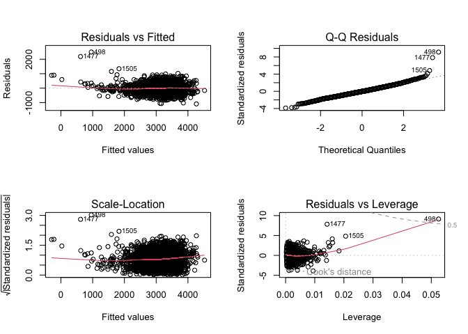
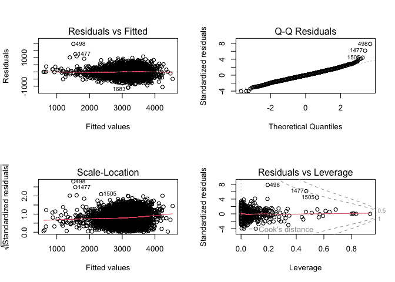
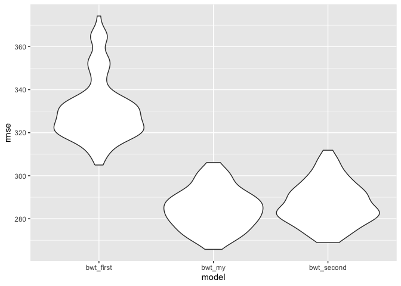

P8105_HW6_sy3269
================
Soomin You

Packages required for this homework, such as `tidyverse` and `readr`,
are loaded.

## Problem 1

The weather data required for this problem 1 is imported.

``` r
weather_df = 
  rnoaa::meteo_pull_monitors(
    c("USW00094728"),
    var = c("PRCP", "TMIN", "TMAX"), 
    date_min = "2017-01-01",
    date_max = "2017-12-31") %>%
  mutate(
    name = recode(id, USW00094728 = "CentralPark_NY"),
    tmin = tmin / 10,
    tmax = tmax / 10) %>%
  select(name, id, everything())
```

    ## using cached file: /Users/soomin.you/Library/Caches/org.R-project.R/R/rnoaa/noaa_ghcnd/USW00094728.dly

    ## date created (size, mb): 2024-09-03 14:09:15.067935 (8.636)

    ## file min/max dates: 1869-01-01 / 2024-09-30

Using the `tmax` as the response and `tmin` as the predictor,
bootstrapping is performed and estimates for 𝑟̂2 and log(𝛽̂0∗𝛽̂1) for each
bootstrap sample are determined.

``` r
boot_straps = 
  weather_df |>
  modelr::bootstrap(5000) |>
  mutate(
    strap = map(strap, as_tibble), 
    models = map(strap, \(df) lm(tmax ~ tmin, data = df)), 
    results_tidy = map(models, broom::tidy),
    results_glance = map(models, broom::glance)
  ) |>
  select(.id, results_tidy, results_glance) |>
  unnest(results_tidy, results_glance)
```

    ## Warning: `unnest()` has a new interface. See `?unnest` for details.
    ## ℹ Try `df %>% unnest(c(results_tidy, results_glance))`, with `mutate()` if
    ##   needed.

``` r
boot_straps |>
  group_by(.id, r.squared) |>
  summarize(log_b0_b1 = log(prod(estimate)), .groups = "drop") 
```

    ## # A tibble: 5,000 × 3
    ##    .id   r.squared log_b0_b1
    ##    <chr>     <dbl>     <dbl>
    ##  1 0001      0.908      2.02
    ##  2 0002      0.900      2.05
    ##  3 0003      0.914      2.01
    ##  4 0004      0.920      2.02
    ##  5 0005      0.908      2.00
    ##  6 0006      0.912      2.01
    ##  7 0007      0.923      1.95
    ##  8 0008      0.906      2.04
    ##  9 0009      0.930      2.01
    ## 10 0010      0.904      2.04
    ## # ℹ 4,990 more rows

``` r
head(boot_straps)
```

    ## # A tibble: 6 × 18
    ##   .id   term      estimate std.error statistic   p.value r.squared adj.r.squared
    ##   <chr> <chr>        <dbl>     <dbl>     <dbl>     <dbl>     <dbl>         <dbl>
    ## 1 0001  (Interce…     7.21    0.232       31.0 3.27e-104     0.908         0.907
    ## 2 0001  tmin          1.04    0.0175      59.7 8.18e-190     0.908         0.907
    ## 3 0002  (Interce…     7.68    0.229       33.5 3.20e-113     0.900         0.899
    ## 4 0002  tmin          1.02    0.0178      57.0 3.39e-183     0.900         0.899
    ## 5 0003  (Interce…     7.07    0.231       30.5 2.60e-102     0.914         0.914
    ## 6 0003  tmin          1.05    0.0170      62.1 2.34e-195     0.914         0.914
    ## # ℹ 10 more variables: sigma <dbl>, statistic1 <dbl>, p.value1 <dbl>, df <dbl>,
    ## #   logLik <dbl>, AIC <dbl>, BIC <dbl>, deviance <dbl>, df.residual <int>,
    ## #   nobs <int>

Then, the distribution of the estimates for 5000 bootstrap sample is
plotted. The distribution is approximately normal, being symmetric with
respect to 1.04.

``` r
boot_straps |>
  filter(term == "tmin") |>
  ggplot(aes(x = estimate)) + 
  geom_density() +
  labs(x = "Estimate", 
       y = "Density", 
       title = "Distribution of the estimates") +
  theme_minimal()
```

<!-- -->

Using the 5000 bootstrap estimates, the 2.5% and 97.5% quantiles to
provide a 95% confidence interval for 𝑟̂2 and log(𝛽̂0∗𝛽̂1) are also found.
The confidence interval is (1.005, 1.073).

``` r
boot_straps |>
  filter(term == "tmin") |> 
  summarize(
    lower = quantile(estimate, probs = 0.025),
    upper = quantile(estimate, probs = 0.975) 
  ) |>
  knitr::kable(digits = 3)
```

| lower | upper |
|------:|------:|
| 1.006 | 1.072 |

## Problem 2

The homicides data gathered by The *Washington Post* in 50 large U.S.
cities is imported and cleaned. An additional variable `city_state` is
added to show both city and state information in one vector, and a
binary variable called `solved` is also added to show cases closed with
arrest as 1 and the others (closed without arrest and open cases) as 0.

Some cities that do not report victim race, such as Dallas, TX; Phoenix,
AZ; and Kansas City, MO are omitted, and a data entry with incorrect
information (e.g. Tulsa, AL) is omitted as well. Data with unknown
victim_age or victim_sex are also omitted for analysis. The analysis
will be limited to the victims whose race is white or black.

``` r
homicide_data = read_csv("./data/homicide-data.csv", na = c("NA", "", ".")) |>
  janitor::clean_names() |>
  mutate(city_state = str_c(city, state, sep = ", "), 
         solved = ifelse(disposition == "Closed by arrest", 1, 0)
  ) |>
  filter(!city_state %in% c("Dallas, TX", "Phoenix, AZ", "Kansas City, MO", "Tulsa, AL"), 
         victim_race %in% c("White", "Black"), 
         victim_age != "Unknown", 
         victim_sex != "Unknown") |>
  mutate(victim_age = as.numeric(victim_age)) 
```

    ## Rows: 52179 Columns: 12
    ## ── Column specification ────────────────────────────────────────────────────────
    ## Delimiter: ","
    ## chr (9): uid, victim_last, victim_first, victim_race, victim_age, victim_sex...
    ## dbl (3): reported_date, lat, lon
    ## 
    ## ℹ Use `spec()` to retrieve the full column specification for this data.
    ## ℹ Specify the column types or set `show_col_types = FALSE` to quiet this message.

For the city of Baltimore, MD, the `glm` function is used to fit a
logistic regression with `solved` as the outcome and `victim_age`,
`victim_sex` and `victim_race` are predictors. The output of glm
function is saved, cleaned using the broom::tidy, and the estimate and
confidence interval of the adjusted odds ratio for solving homicides
comparing male victims to female victims, with all the other variables
fixed, are found.

``` r
baltimore_model = 
  homicide_data |>
  filter(city_state == "Baltimore, MD") |>
  glm(solved ~ victim_age + victim_sex + victim_race, data = _) |>
  broom::tidy()

baltimore_model |>
  filter(term =="victim_sexMale") |>
  mutate(
    odds_ratio = exp(estimate), 
    conf_int_lower = exp(estimate - 1.96 * std.error), 
    conf_int_upper = exp(estimate + 1.96 * std.error)
  ) |>
  select(term, estimate, odds_ratio, conf_int_lower, conf_int_upper) |>
  knitr::kable(digit = 3)
```

| term           | estimate | odds_ratio | conf_int_lower | conf_int_upper |
|:---------------|---------:|-----------:|---------------:|---------------:|
| victim_sexMale |   -0.204 |      0.816 |          0.766 |          0.868 |

Then, for each of the 50 cities, the adjusted odds ratio and confidence
interval for solving homicides comparing male victims to female victims
are calculated.

``` r
city_model = function(name) { 
  
  city_data = 
    homicide_data |>
    filter(city_state == name) 
    
  glm(solved ~ victim_age + victim_sex + victim_race, data = city_data) |>
    broom::tidy()
}

unique_city_state = 
  homicide_data |>
  distinct(city_state) |>
  pull(city_state)

city_simulation = 
  tibble(
    unique_name = unique_city_state
  ) |>
  mutate(data = map(unique_name, city_model)) |>
  unnest(data) 

city_simulation |>
  filter(term == "victim_sexMale") |>
  mutate(
    odds_ratio = exp(estimate), 
    conf_int_lower = exp(estimate - 1.96 * std.error), 
    conf_int_upper = exp(estimate + 1.96 * std.error)
  ) |>
  select(unique_name, estimate, odds_ratio, conf_int_lower, conf_int_upper) |>
  knitr::kable(digit = 3)
```

| unique_name        | estimate | odds_ratio | conf_int_lower | conf_int_upper |
|:-------------------|---------:|-----------:|---------------:|---------------:|
| Albuquerque, NM    |    0.130 |      1.139 |          0.963 |          1.348 |
| Atlanta, GA        |    0.001 |      1.001 |          0.915 |          1.094 |
| Baltimore, MD      |   -0.204 |      0.816 |          0.766 |          0.868 |
| Baton Rouge, LA    |   -0.220 |      0.802 |          0.702 |          0.917 |
| Birmingham, AL     |   -0.034 |      0.967 |          0.874 |          1.069 |
| Boston, MA         |   -0.082 |      0.921 |          0.803 |          1.056 |
| Buffalo, NY        |   -0.152 |      0.859 |          0.751 |          0.982 |
| Charlotte, NC      |   -0.023 |      0.977 |          0.895 |          1.067 |
| Chicago, IL        |   -0.196 |      0.822 |          0.788 |          0.857 |
| Cincinnati, OH     |   -0.192 |      0.825 |          0.739 |          0.921 |
| Columbus, OH       |   -0.155 |      0.857 |          0.788 |          0.931 |
| Denver, CO         |   -0.177 |      0.838 |          0.709 |          0.991 |
| Detroit, MI        |   -0.133 |      0.876 |          0.828 |          0.926 |
| Durham, NC         |   -0.046 |      0.955 |          0.811 |          1.124 |
| Fort Worth, TX     |   -0.094 |      0.910 |          0.805 |          1.029 |
| Fresno, CA         |    0.061 |      1.063 |          0.890 |          1.270 |
| Houston, TX        |   -0.084 |      0.919 |          0.866 |          0.976 |
| Indianapolis, IN   |   -0.020 |      0.981 |          0.912 |          1.054 |
| Jacksonville, FL   |   -0.081 |      0.922 |          0.858 |          0.991 |
| Las Vegas, NV      |   -0.041 |      0.960 |          0.892 |          1.034 |
| Long Beach, CA     |   -0.177 |      0.838 |          0.692 |          1.014 |
| Los Angeles, CA    |   -0.100 |      0.905 |          0.828 |          0.989 |
| Louisville, KY     |   -0.157 |      0.854 |          0.769 |          0.949 |
| Memphis, TN        |   -0.064 |      0.938 |          0.880 |          0.999 |
| Miami, FL          |   -0.157 |      0.855 |          0.757 |          0.966 |
| Milwaukee, wI      |   -0.071 |      0.932 |          0.857 |          1.013 |
| Minneapolis, MN    |   -0.013 |      0.987 |          0.833 |          1.169 |
| Nashville, TN      |    0.008 |      1.008 |          0.916 |          1.109 |
| New Orleans, LA    |   -0.126 |      0.881 |          0.818 |          0.950 |
| New York, NY       |   -0.270 |      0.764 |          0.676 |          0.863 |
| Oakland, CA        |   -0.134 |      0.875 |          0.790 |          0.968 |
| Oklahoma City, OK  |   -0.006 |      0.994 |          0.890 |          1.109 |
| Omaha, NE          |   -0.174 |      0.840 |          0.747 |          0.944 |
| Philadelphia, PA   |   -0.161 |      0.852 |          0.800 |          0.906 |
| Pittsburgh, PA     |   -0.194 |      0.824 |          0.738 |          0.919 |
| Richmond, VA       |    0.003 |      1.003 |          0.870 |          1.155 |
| San Antonio, TX    |   -0.081 |      0.922 |          0.807 |          1.053 |
| Sacramento, CA     |   -0.087 |      0.916 |          0.787 |          1.067 |
| Savannah, GA       |   -0.035 |      0.966 |          0.808 |          1.154 |
| San Bernardino, CA |   -0.167 |      0.846 |          0.656 |          1.091 |
| San Diego, CA      |   -0.174 |      0.841 |          0.730 |          0.968 |
| San Francisco, CA  |   -0.105 |      0.901 |          0.782 |          1.037 |
| St. Louis, MO      |   -0.087 |      0.917 |          0.855 |          0.983 |
| Stockton, CA       |    0.072 |      1.075 |          0.891 |          1.296 |
| Tampa, FL          |   -0.052 |      0.949 |          0.771 |          1.168 |
| Tulsa, OK          |   -0.005 |      0.995 |          0.902 |          1.098 |
| Washington, DC     |   -0.088 |      0.915 |          0.835 |          1.004 |

## Problem 3

The birthweight data is loaded and cleaned. Missing values are dropped
and some of the numeric variables are converted to factor variables. For
example, the race of father and mother is changed from numeric values to
appropriate categories.

``` r
birthweight_df = 
  read_csv("./data/birthweight.csv", na = c("NA", "", ".")) |>
  janitor::clean_names() |>
  mutate(
    id = row_number(),
    babysex = case_match(babysex, 
                         1 ~ "male", 
                         2 ~ "female"), 
    babysex = fct_infreq(babysex), 
    frace = case_match(frace, 
                       1 ~ "White", 
                       2 ~ "Black", 
                       3 ~ "Asian", 
                       4 ~ "Puerto Rican", 
                       8 ~ "Other", 
                       9 ~ "Unknown"), 
    frace = fct_infreq(frace),
    malform = case_match(malform, 
                         0 ~ "absent", 
                         1 ~ "present"), 
    malform = fct_infreq(malform),
    mrace = case_match(mrace, 
                       1 ~ "White", 
                       2 ~ "Black", 
                       3 ~ "Asian", 
                       4 ~ "Puerto Rican", 
                       8 ~ "Other", 
                       9 ~ "Unknown"), 
     mrace = fct_infreq(mrace), 
  )
```

    ## Rows: 4342 Columns: 20
    ## ── Column specification ────────────────────────────────────────────────────────
    ## Delimiter: ","
    ## dbl (20): babysex, bhead, blength, bwt, delwt, fincome, frace, gaweeks, malf...
    ## 
    ## ℹ Use `spec()` to retrieve the full column specification for this data.
    ## ℹ Specify the column types or set `show_col_types = FALSE` to quiet this message.

To build a regression model for birthweight of this dataset, I will
first look at some of the factors that seem directly related to the
weight of mother and some factors that are baby specific. The predictors
are as follows:

- bhead: baby’s head circumference at birth (centimeters)
- blength: baby’s length at birth (centimeteres)
- gaweeks: gestational age in weeks
- delwt: mother’s weight at delivery (pounds)
- mheight: mother’s height (inches)
- ppbmi: mother’s pre-pregnancy BMI
- ppwt: mother’s pre-pregnancy weight (pounds)
- wtgain: mother’s weight gain during pregnancy (pounds)

``` r
bwt_model_fit = 
  lm(bwt ~  bhead + blength + gaweeks + delwt + mheight + ppbmi + ppwt + wtgain, 
     data = birthweight_df) 

summary(bwt_model_fit)
```

    ## 
    ## Call:
    ## lm(formula = bwt ~ bhead + blength + gaweeks + delwt + mheight + 
    ##     ppbmi + ppwt + wtgain, data = birthweight_df)
    ## 
    ## Residuals:
    ##     Min      1Q  Median      3Q     Max 
    ## -1090.9  -182.8    -7.3   174.5  2502.3 
    ## 
    ## Coefficients: (1 not defined because of singularities)
    ##               Estimate Std. Error t value Pr(>|t|)    
    ## (Intercept) -6969.0621   675.5086 -10.317   <2e-16 ***
    ## bhead         135.3040     3.4862  38.811   <2e-16 ***
    ## blength        77.8608     2.0705  37.606   <2e-16 ***
    ## gaweeks        13.6979     1.4865   9.215   <2e-16 ***
    ## delwt           3.6508     0.4031   9.056   <2e-16 ***
    ## mheight        14.1502    10.5818   1.337    0.181    
    ## ppbmi           7.1349    15.3145   0.466    0.641    
    ## ppwt           -3.7825     2.6880  -1.407    0.159    
    ## wtgain              NA         NA      NA       NA    
    ## ---
    ## Signif. codes:  0 '***' 0.001 '**' 0.01 '*' 0.05 '.' 0.1 ' ' 1
    ## 
    ## Residual standard error: 281.2 on 4334 degrees of freedom
    ## Multiple R-squared:  0.6991, Adjusted R-squared:  0.6986 
    ## F-statistic:  1438 on 7 and 4334 DF,  p-value: < 2.2e-16

``` r
par(mfrow = c(2, 2))
plot(bwt_model_fit)
```

<!-- -->

``` r
alias(bwt_model_fit)
```

    ## Model :
    ## bwt ~ bhead + blength + gaweeks + delwt + mheight + ppbmi + ppwt + 
    ##     wtgain
    ## 
    ## Complete :
    ##        (Intercept) bhead blength gaweeks delwt mheight ppbmi ppwt
    ## wtgain  0           0     0       0       1     0       0    -1

According to the model summary, the adjusted R-squared value is only
0.70. And according to the QQ plot, there are few outliers that hinder
almost linear relationship. Hence, alias function was used to check
multilinearity. It was found that `delwt`, `ppwt` and `wtgain` are
correlated.

To improve this model, `delwt`, `ppwt` will be removed and only `wtgain`
will be used as a predictor.

``` r
bwt_model_new = 
  lm(bwt ~ bhead + blength + gaweeks + mheight + ppbmi + wtgain, 
     data = birthweight_df) 

summary(bwt_model_new)
```

    ## 
    ## Call:
    ## lm(formula = bwt ~ bhead + blength + gaweeks + mheight + ppbmi + 
    ##     wtgain, data = birthweight_df)
    ## 
    ## Residuals:
    ##      Min       1Q   Median       3Q      Max 
    ## -1090.61  -182.63    -7.45   174.42  2502.28 
    ## 
    ## Coefficients:
    ##               Estimate Std. Error t value Pr(>|t|)    
    ## (Intercept) -6936.2627   134.4187 -51.602  < 2e-16 ***
    ## bhead         135.3081     3.4848  38.828  < 2e-16 ***
    ## blength        77.8608     2.0702  37.610  < 2e-16 ***
    ## gaweeks        13.6975     1.4863   9.216  < 2e-16 ***
    ## mheight        13.6323     1.6388   8.319  < 2e-16 ***
    ## ppbmi           6.3792     1.3673   4.666 3.17e-06 ***
    ## wtgain          3.6508     0.4031   9.057  < 2e-16 ***
    ## ---
    ## Signif. codes:  0 '***' 0.001 '**' 0.01 '*' 0.05 '.' 0.1 ' ' 1
    ## 
    ## Residual standard error: 281.2 on 4335 degrees of freedom
    ## Multiple R-squared:  0.6991, Adjusted R-squared:  0.6986 
    ## F-statistic:  1678 on 6 and 4335 DF,  p-value: < 2.2e-16

``` r
alias(bwt_model_new)
```

    ## Model :
    ## bwt ~ bhead + blength + gaweeks + mheight + ppbmi + wtgain

``` r
car::vif(bwt_model_new)
```

    ##    bhead  blength  gaweeks  mheight    ppbmi   wtgain 
    ## 1.751480 1.745667 1.207181 1.040722 1.039579 1.068796

``` r
par(mfrow = c(2, 2))
plot(bwt_model_new)
```

<!-- -->

Adjusting the predictors did not improve the adjusted R-squared value
but successfully removed the alias. VIF was also checked and without any
outstanding number, there seems to be no multicollinearity issue.
However, residual vs leverage plot is worth noting as it indicates an
influential point on the right upper corner.

To further refine the model, a possible interaction was checked.

``` r
bwt_model_int = 
  lm(bwt ~ bhead * blength * gaweeks * mheight * ppbmi * wtgain, 
     data = birthweight_df) 

summary(bwt_model_int)
```

    ## 
    ## Call:
    ## lm(formula = bwt ~ bhead * blength * gaweeks * mheight * ppbmi * 
    ##     wtgain, data = birthweight_df)
    ## 
    ## Residuals:
    ##      Min       1Q   Median       3Q      Max 
    ## -1104.22  -178.29    -5.04   176.04  1954.12 
    ## 
    ## Coefficients:
    ##                                              Estimate Std. Error t value
    ## (Intercept)                                -3.042e+06  2.128e+06  -1.430
    ## bhead                                       7.486e+04  6.642e+04   1.127
    ## blength                                     7.229e+04  4.758e+04   1.519
    ## gaweeks                                     1.099e+05  5.784e+04   1.899
    ## mheight                                     4.905e+04  3.382e+04   1.450
    ## ppbmi                                       1.253e+05  9.468e+04   1.324
    ## wtgain                                      7.342e+04  1.292e+05   0.568
    ## bhead:blength                              -1.824e+03  1.422e+03  -1.283
    ## bhead:gaweeks                              -2.879e+03  1.785e+03  -1.613
    ## blength:gaweeks                            -2.496e+03  1.273e+03  -1.960
    ## bhead:mheight                              -1.226e+03  1.055e+03  -1.162
    ## blength:mheight                            -1.164e+03  7.564e+02  -1.539
    ## gaweeks:mheight                            -1.741e+03  9.165e+02  -1.900
    ## bhead:ppbmi                                -3.392e+03  2.944e+03  -1.152
    ## blength:ppbmi                              -3.006e+03  2.126e+03  -1.414
    ## gaweeks:ppbmi                              -4.231e+03  2.562e+03  -1.651
    ## mheight:ppbmi                              -2.015e+03  1.504e+03  -1.339
    ## bhead:wtgain                               -9.812e+02  3.924e+03  -0.250
    ## blength:wtgain                             -1.779e+03  2.673e+03  -0.666
    ## gaweeks:wtgain                             -3.198e+03  3.446e+03  -0.928
    ## mheight:wtgain                             -1.206e+03  2.049e+03  -0.589
    ## ppbmi:wtgain                               -3.038e+03  5.790e+03  -0.525
    ## bhead:blength:gaweeks                       6.612e+01  3.783e+01   1.748
    ## bhead:blength:mheight                       2.975e+01  2.260e+01   1.316
    ## bhead:gaweeks:mheight                       4.596e+01  2.827e+01   1.626
    ## blength:gaweeks:mheight                     3.959e+01  2.019e+01   1.961
    ## bhead:blength:ppbmi                         8.223e+01  6.319e+01   1.301
    ## bhead:gaweeks:ppbmi                         1.174e+02  7.879e+01   1.490
    ## blength:gaweeks:ppbmi                       9.799e+01  5.662e+01   1.731
    ## bhead:mheight:ppbmi                         5.529e+01  4.675e+01   1.183
    ## blength:mheight:ppbmi                       4.814e+01  3.379e+01   1.425
    ## gaweeks:mheight:ppbmi                       6.673e+01  4.057e+01   1.645
    ## bhead:blength:wtgain                        2.860e+01  7.961e+01   0.359
    ## bhead:gaweeks:wtgain                        6.371e+01  1.041e+02   0.612
    ## blength:gaweeks:wtgain                      7.240e+01  7.092e+01   1.021
    ## bhead:mheight:wtgain                        1.747e+01  6.211e+01   0.281
    ## blength:mheight:wtgain                      2.884e+01  4.233e+01   0.681
    ## gaweeks:mheight:wtgain                      5.083e+01  5.458e+01   0.931
    ## bhead:ppbmi:wtgain                          5.152e+01  1.750e+02   0.294
    ## blength:ppbmi:wtgain                        7.421e+01  1.193e+02   0.622
    ## gaweeks:ppbmi:wtgain                        1.232e+02  1.547e+02   0.796
    ## mheight:ppbmi:wtgain                        4.974e+01  9.195e+01   0.541
    ## bhead:blength:gaweeks:mheight              -1.055e+00  5.999e-01  -1.758
    ## bhead:blength:gaweeks:ppbmi                -2.733e+00  1.674e+00  -1.632
    ## bhead:blength:mheight:ppbmi                -1.332e+00  1.005e+00  -1.326
    ## bhead:gaweeks:mheight:ppbmi                -1.867e+00  1.247e+00  -1.497
    ## blength:gaweeks:mheight:ppbmi              -1.545e+00  8.973e-01  -1.722
    ## bhead:blength:gaweeks:wtgain               -1.518e+00  2.106e+00  -0.721
    ## bhead:blength:mheight:wtgain               -4.857e-01  1.259e+00  -0.386
    ## bhead:gaweeks:mheight:wtgain               -1.031e+00  1.646e+00  -0.626
    ## blength:gaweeks:mheight:wtgain             -1.145e+00  1.122e+00  -1.021
    ## bhead:blength:ppbmi:wtgain                 -1.425e+00  3.539e+00  -0.403
    ## bhead:gaweeks:ppbmi:wtgain                 -2.630e+00  4.654e+00  -0.565
    ## blength:gaweeks:ppbmi:wtgain               -2.839e+00  3.174e+00  -0.894
    ## bhead:mheight:ppbmi:wtgain                 -8.977e-01  2.774e+00  -0.324
    ## blength:mheight:ppbmi:wtgain               -1.195e+00  1.893e+00  -0.632
    ## gaweeks:mheight:ppbmi:wtgain               -1.954e+00  2.454e+00  -0.796
    ## bhead:blength:gaweeks:mheight:ppbmi         4.338e-02  2.653e-02   1.635
    ## bhead:blength:gaweeks:mheight:wtgain        2.432e-02  3.327e-02   0.731
    ## bhead:blength:gaweeks:ppbmi:wtgain          6.355e-02  9.383e-02   0.677
    ## bhead:blength:mheight:ppbmi:wtgain          2.383e-02  5.604e-02   0.425
    ## bhead:gaweeks:mheight:ppbmi:wtgain          4.257e-02  7.369e-02   0.578
    ## blength:gaweeks:mheight:ppbmi:wtgain        4.471e-02  5.028e-02   0.889
    ## bhead:blength:gaweeks:mheight:ppbmi:wtgain -1.016e-03  1.485e-03  -0.684
    ##                                            Pr(>|t|)  
    ## (Intercept)                                  0.1529  
    ## bhead                                        0.2598  
    ## blength                                      0.1287  
    ## gaweeks                                      0.0576 .
    ## mheight                                      0.1471  
    ## ppbmi                                        0.1856  
    ## wtgain                                       0.5699  
    ## bhead:blength                                0.1996  
    ## bhead:gaweeks                                0.1068  
    ## blength:gaweeks                              0.0500 .
    ## bhead:mheight                                0.2455  
    ## blength:mheight                              0.1239  
    ## gaweeks:mheight                              0.0575 .
    ## bhead:ppbmi                                  0.2493  
    ## blength:ppbmi                                0.1575  
    ## gaweeks:ppbmi                                0.0988 .
    ## mheight:ppbmi                                0.1806  
    ## bhead:wtgain                                 0.8026  
    ## blength:wtgain                               0.5057  
    ## gaweeks:wtgain                               0.3535  
    ## mheight:wtgain                               0.5562  
    ## ppbmi:wtgain                                 0.5999  
    ## bhead:blength:gaweeks                        0.0806 .
    ## bhead:blength:mheight                        0.1882  
    ## bhead:gaweeks:mheight                        0.1041  
    ## blength:gaweeks:mheight                      0.0500 *
    ## bhead:blength:ppbmi                          0.1932  
    ## bhead:gaweeks:ppbmi                          0.1363  
    ## blength:gaweeks:ppbmi                        0.0836 .
    ## bhead:mheight:ppbmi                          0.2370  
    ## blength:mheight:ppbmi                        0.1543  
    ## gaweeks:mheight:ppbmi                        0.1001  
    ## bhead:blength:wtgain                         0.7195  
    ## bhead:gaweeks:wtgain                         0.5406  
    ## blength:gaweeks:wtgain                       0.3074  
    ## bhead:mheight:wtgain                         0.7785  
    ## blength:mheight:wtgain                       0.4957  
    ## gaweeks:mheight:wtgain                       0.3517  
    ## bhead:ppbmi:wtgain                           0.7685  
    ## blength:ppbmi:wtgain                         0.5341  
    ## gaweeks:ppbmi:wtgain                         0.4260  
    ## mheight:ppbmi:wtgain                         0.5886  
    ## bhead:blength:gaweeks:mheight                0.0787 .
    ## bhead:blength:gaweeks:ppbmi                  0.1027  
    ## bhead:blength:mheight:ppbmi                  0.1850  
    ## bhead:gaweeks:mheight:ppbmi                  0.1345  
    ## blength:gaweeks:mheight:ppbmi                0.0852 .
    ## bhead:blength:gaweeks:wtgain                 0.4711  
    ## bhead:blength:mheight:wtgain                 0.6997  
    ## bhead:gaweeks:mheight:wtgain                 0.5312  
    ## blength:gaweeks:mheight:wtgain               0.3075  
    ## bhead:blength:ppbmi:wtgain                   0.6873  
    ## bhead:gaweeks:ppbmi:wtgain                   0.5721  
    ## blength:gaweeks:ppbmi:wtgain                 0.3711  
    ## bhead:mheight:ppbmi:wtgain                   0.7463  
    ## blength:mheight:ppbmi:wtgain                 0.5277  
    ## gaweeks:mheight:ppbmi:wtgain                 0.4259  
    ## bhead:blength:gaweeks:mheight:ppbmi          0.1021  
    ## bhead:blength:gaweeks:mheight:wtgain         0.4648  
    ## bhead:blength:gaweeks:ppbmi:wtgain           0.4982  
    ## bhead:blength:mheight:ppbmi:wtgain           0.6707  
    ## bhead:gaweeks:mheight:ppbmi:wtgain           0.5636  
    ## blength:gaweeks:mheight:ppbmi:wtgain         0.3739  
    ## bhead:blength:gaweeks:mheight:ppbmi:wtgain   0.4940  
    ## ---
    ## Signif. codes:  0 '***' 0.001 '**' 0.01 '*' 0.05 '.' 0.1 ' ' 1
    ## 
    ## Residual standard error: 277.5 on 4278 degrees of freedom
    ## Multiple R-squared:  0.7108, Adjusted R-squared:  0.7065 
    ## F-statistic: 166.9 on 63 and 4278 DF,  p-value: < 2.2e-16

``` r
alias(bwt_model_int)
```

    ## Model :
    ## bwt ~ bhead * blength * gaweeks * mheight * ppbmi * wtgain

``` r
par(mfrow = c(2, 2))
plot(bwt_model_int)
```

<!-- -->

According to this model, the adjusted R sqaured value was slightly
higher than the previous model. Some significant interaction was
checked, but no multilinearity was found.

I will use this model to calculate estimated predictions and residuals.

Once the predictions and residuals are found using `add_predictions` and
`add_residuals` functions, these values are plotted against each other.

``` r
birthweight_df |>
  modelr::add_predictions(bwt_model_int) |>
  modelr::add_residuals(bwt_model_int) |>
  ggplot(aes(x = pred, y = resid)) +
  geom_point()
```

<!-- -->

The model built above is compared to two other models using cross
validation. The two other models are as follows:

1)  One using length at birth and gestational age as predictors (main
    effects only)

2)  One using head circumference, length, sex, and all interactions
    (including the three-way interaction) between these.

``` r
cv_df = 
  crossv_mc(birthweight_df, 100) 

cv_df =
  cv_df |> 
  mutate(
    train = map(train, as_tibble),
    test = map(test, as_tibble))

cv_res_df = 
  cv_df |>
  mutate(
    bwt_my_model = map(train, \(df) lm(bwt ~ bhead * blength * gaweeks * mheight * 
                                         ppbmi * wtgain, data = df)),
    bwt_first_model = map(train, \(df) lm(bwt ~ blength + gaweeks, data = df)), 
    bwt_second_model = map(train, \(df) lm(bwt ~ bhead * blength * babysex, data = df))
  ) |>
  mutate(
    rmse_bwt_my = map2_dbl(bwt_my_model, test, rmse), 
    rmse_bwt_first = map2_dbl(bwt_first_model, test, rmse), 
    rmse_bwt_second = map2_dbl(bwt_second_model, test, rmse)
  )

cv_res_df |>
  dplyr::select(starts_with("rmse")) |>
  pivot_longer(
    everything(), 
    names_to = "model", 
    values_to = "rmse", 
    names_prefix = "rmse_"
  ) |>
  ggplot(aes(x = model, y = rmse)) +
  geom_violin()
```

<!-- -->
